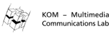

# Network Slicing

		
  		
 
		
 	
 ------------------------		

This project was generated with [Angular CLI](https://github.com/angular/angular-cli) version 1.0.0.

An angular2 + [truffle](https://github.com/trufflesuite/truffle) starter app. Write, compile & deploy smart contracts for Ethereum.

## Demo
Coming soon ...

## How to use
There are 2 small parts to successfully run this project.

### Part 1

Download and install the project localy on your computer:

1. `git clone https://dev.kom.e-technik.tu-darmstadt.de/gitlab/aoc-theses/WS18-MSc-JordiBisbalAnsaldo--NetworkSlicing.git`
2. `cd network-slicing-prototype`
3. `npm install`

### Part 2
For the second part, be sure you're connected to an Ethereum client before running the commands below. We will use geth to create our own private chain.

4. Go to to the geth folder `cd geth`
5. Start a node with the initialized genesis block:
`geth --port 3000 --networkid 58342 --nodiscover --datadir="privchain/" --maxpeers=0 --rpc --rpcport 8545 --rpcaddr 127.0.0.1 --rpccorsdomain "http://localhost:8080" --rpcapi "eth,net,web3,personal"`
6. To attach the console or Mist to geth:
`geth attach ipc://path-to-gitrepository/geth/privchain/geth.ipc`
`mist --rpc path-to-gitrepository/geth/privchain/geth.ipc --swarmurl "null"`
7. Remember to call  `miner.start()` before compiling or interacting with the BC.

And then in the first tab, run:

8. `truffle compile` to compile your contracts
9. `truffle migrate` to deploy those contracts to the network
10. `npm start`. Navigate to `http://localhost:8080/`. The app will automatically reload if you change any of the source files.

## Running unit tests

Coming soon...

1. Run `ng test` to execute the unit tests via [Karma](https://karma-runner.github.io).
2. Run `truffle test` to run tests associated with your solidity smart contracts. The test folder for this can be found in the `test` directory at the root level of this project

## Contributors
1. [Jordi Bisbal](https://dev.kom.e-technik.tu-darmstadt.de/gitlab/jb64lori)

## Further help

To get more help on the Angular CLI use `ng help` or go check out the [Angular CLI README](https://github.com/angular/angular-cli/blob/master/README.md).
You can also contact me by: jordi.bisbalansaldo@stud.tu-darmstadt.de

## Technologies & Languages Used
1. Angular2 (HTML/Typescript)
2. Web3.js
3. Truffle (Solidity)
